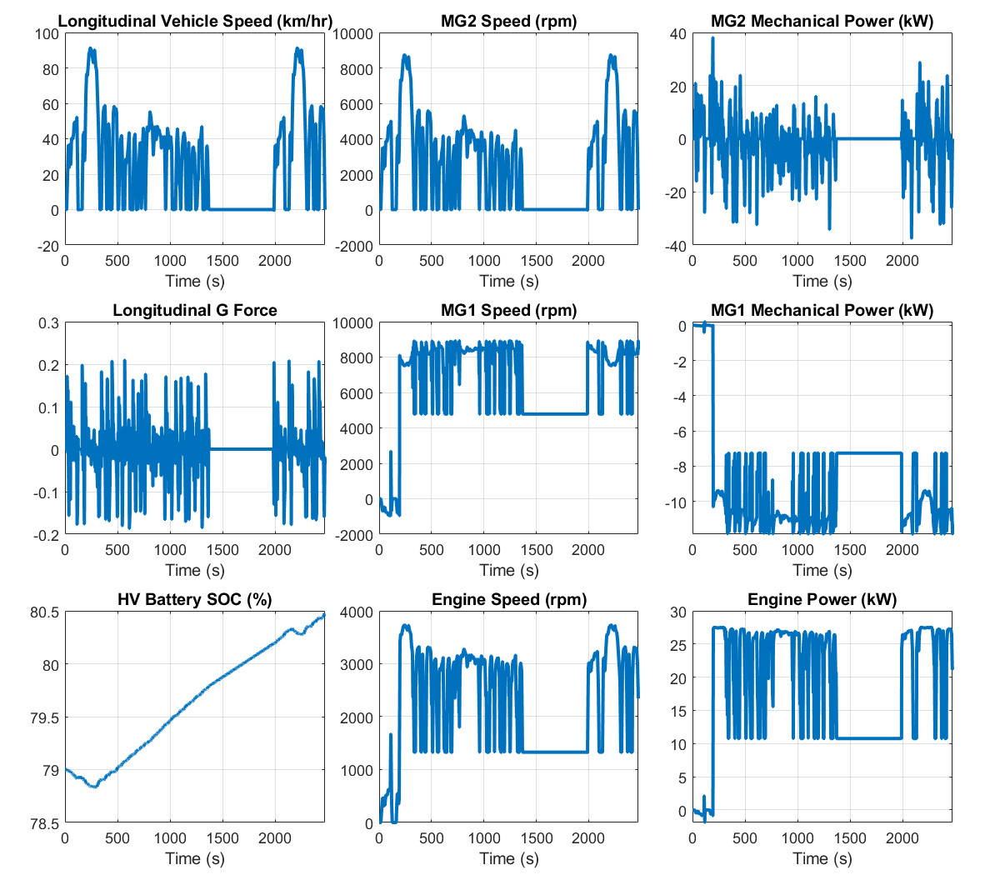

# Hybrid Electric Vehicle Model in Simscape&trade;

Version 1.3

## Introduction

This example includes a Hybrid Electric Vehicle model
in Simscape&trade;,
demonstrating some new features of the recent releases
of MATLAB&reg;
and featuring Subsystem Reference which enables
modular physical modeling workflow.

The model includes
an abstract Power-Split Hybrid Electric Vehicle (HEV) model
with a simple rule-based controller
for speed tracking simulation.
It can be used to better understand
how to work with [Subsystem Reference][url_subref]
for an automotive application.
For a vehicle model that includes
more detailed supervisory and engine controllers,
please see the reference applications in
[Powertrain Blockset&trade;][url_ptbsref].

[url_subref]:https://www.mathworks.com/help/simulink/ug/referenced-subsystem-1.html

[url_ptbsref]:https://www.mathworks.com/help/autoblks/powertrain-reference-applications.html

The included abstract model is suitable
for the system level simulation of
longitudinal vehicle behavior
as it runs faster than real time.
The model consists of components such as motor, engine,
power-split device, and so on,
and they are built in a modular manner using
Subsystem Reference and Simscape product family
demonstrating a workflow where
physical components are built and tested individually
and also they can be easily integrated into
a complete vehicle system model.

The HEV model and its component files are managed
by a MATLAB project and
some components come with their own test setups.

## For MATLAB R2022a

Version 1.3 is available.
This version requires
[MATLAB](https://www.mathworks.com/products/matlab.html),
[Simulink&reg;](https://www.mathworks.com/products/simulink.html),
[Simscape](https://www.mathworks.com/products/simscape.html),
[Simscape Driveline&trade;](https://www.mathworks.com/products/simscape-driveline.html),
[Simscape Electrical&trade;](https://www.mathworks.com/products/simscape-electrical.html),
[Stateflow&reg;](https://www.mathworks.com/products/stateflow.html),
[Powertrain Blockset](https://www.mathworks.com/products/powertrain.html)
and optionally
[Parallel Computing Toolbox&trade;](https://www.mathworks.com/products/parallel-computing.html).

Git Repository - Fork or clone this to get Git repository data.

- Repository: https://github.com/mathworks/Simscape-Hybrid-Electric-Vehicle-Model/tree/R2022a

## For MATLAB R2021a and R2021b

Version 1.2 is available.
This version requires
[MATLAB](https://www.mathworks.com/products/matlab.html),
[Simulink&reg;](https://www.mathworks.com/products/simulink.html),
[Simscape](https://www.mathworks.com/products/simscape.html),
[Simscape Driveline&trade;](https://www.mathworks.com/products/simscape-driveline.html),
[Simscape Electrical&trade;](https://www.mathworks.com/products/simscape-electrical.html),
[Stateflow&reg;](https://www.mathworks.com/products/stateflow.html),
[Powertrain Blockset](https://www.mathworks.com/products/powertrain.html)
and optionally
[Parallel Computing Toolbox&trade;](https://www.mathworks.com/products/parallel-computing.html)

Download Project - This does not include Git repository data.

- https://github.com/mathworks/Simscape-Hybrid-Electric-Vehicle-Model/archive/refs/tags/v1.2.0.zip

Git Repository - Fork or clone this to get Git repository data.

- https://github.com/mathworks/Simscape-Hybrid-Electric-Vehicle-Model/tree/R2021a0

## How to Use

Open `HybridElectricVehicle.prj` in MATLAB, and
it will automatically open the Live Script `HEVProject_main_script.mlx`.
The script contains the description of the model and
hyperlinks to models and scripts.

## How to Use in MATLAB Online

You can try this in [MATLAB Online][url_online].
In MATLAB Online, from the **HOME** tab in the toolstrip,
select **Add-Ons** &rarr; **Get Add-Ons**
to open the Add-On Explorer.
Then search for the submission name,
navigate to the submission page,
click **Add** button, and select **Save to MATLAB Drive**.

[url_online]:https://www.mathworks.com/products/matlab-online.html

## Changes

See [`ChangeLog.md`](ChangeLog.md) for changes in each version.

## License

See [`LICENSE.txt`](LICENSE.txt).

_Copyright 2021-2022 The MathWorks, Inc._
